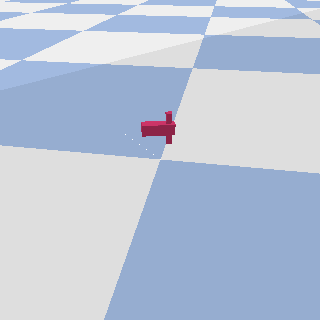

# minimal example of running pybullet under google cloud dataflow

super minimal project setup for running [pybullet](https://pybullet.org/)
renders under [google cloud dataflow](https://cloud.google.com/dataflow/)

this example includes ...

* minimal python scaffolding for a non standard dataflow dependency
* manifested input (one line -> one unit of work)
* saving renders to cloud storage (job side effect)

TODO:

* tuning for this style of manifested job
* pull an example of Counters in DoFn across from another project

## dependencies

see `requirements.txt` for python deps to run the local version

to run the version on data flow you need to ...

1. sign up for [the google cloud platform](https://console.cloud.google.com/)
1. create a [project](https://console.cloud.google.com/projectcreate) (this will be PROJECT env var below)
1. go to [API console page](https://console.cloud.google.com/apis/dashboard), search for the dataflow API and enable it
1. go to cloud storage and create a bucket (this will be the BUCKET env var below)

(this is untested though and i'm likely missing something here...)

## running locally

run with default localrunner

```

cat seeds.txt
1
2
3
4

python3 gen_data_main.py \
  --input ./seeds.txt \
  --output-render-png /tmp \
  --output-render-info render_info
```

output is information on the renders; including paths to the renders

```
cat render_info-00000-of-00001

{'seed': 1, 'urdf_id': 2, 'render_fname': '/tmp/seed_000001.png'}
{'seed': 2, 'urdf_id': 0, 'render_fname': '/tmp/seed_000002.png'}
{'seed': 3, 'urdf_id': 3, 'render_fname': '/tmp/seed_000003.png'}
{'seed': 4, 'urdf_id': 3, 'render_fname': '/tmp/seed_000004.png'}
```

```
eog /tmp/seed_000003.png
```



## run on dataflow

```
export PROJECT=YOUR_PRJ
export BUCKET=YOUR_BUCKET
gsutil cp seeds.txt gs://$BUCKET/gen_data/
python3 gen_data_main.py \
  --job_name gen-data-$USER \
  --project $PROJECT \
  --runner DataflowRunner \
  --setup_file ./setup.py \
  --staging_location gs://$BUCKET/_staging \
  --temp_location gs://$BUCKET/_tmp \
  --input gs://$BUCKET/gen_data/seeds.txt \
  --output-render-png gs://$BUCKET/gen_data/renders \
  --output-render-info gs://$BUCKET/gen_data/render_info
```

output is potentially sharded

```
gsutil cat gs://$BUCKET/gen_data/render_info*

{'seed': 3, 'urdf_id': 3, 'render_fname': 'gs://YOUR_BUCKET/gen_data/renders/seed_000003.png'}
{'seed': 2, 'urdf_id': 0, 'render_fname': 'gs://YOUR_BUCKET/gen_data/renders/seed_000002.png'}
{'seed': 1, 'urdf_id': 2, 'render_fname': 'gs://YOUR_BUCKET/gen_data/renders/seed_000001.png'}
{'seed': 4, 'urdf_id': 3, 'render_fname': 'gs://YOUR_BUCKET/gen_data/renders/seed_000004.png'}
```
